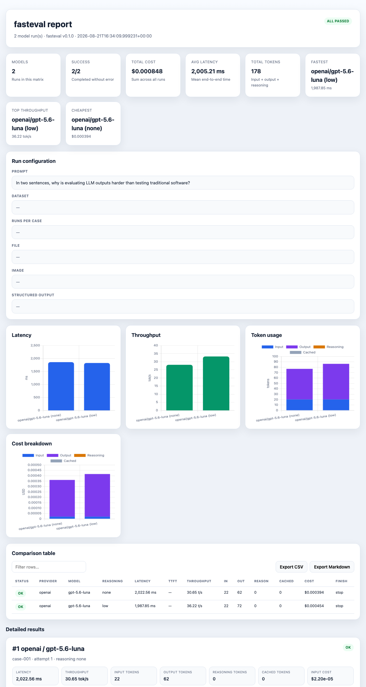
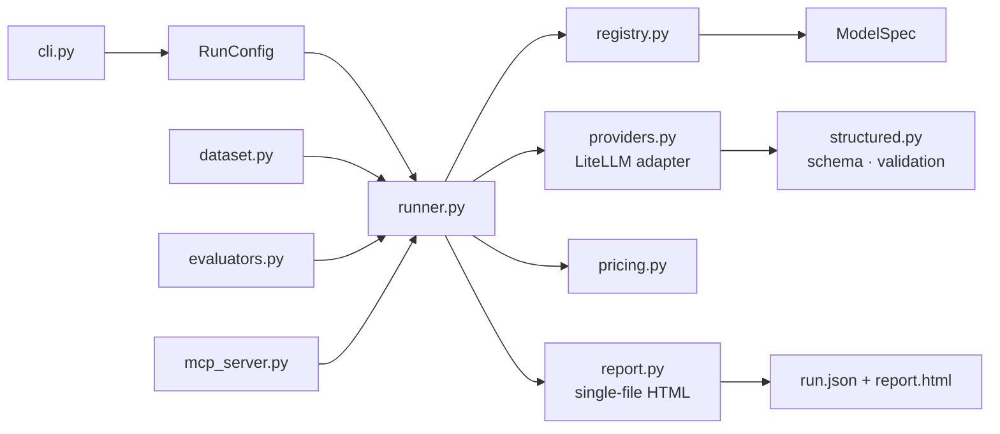

# fastevals

**Evaluation tooling your AI agents can drive.**

fastevals is a small, provider-agnostic evaluation runner for LLM
applications. Run one prompt — or a whole dataset — across a matrix of
models, reasoning efforts and providers, save every response, and get a
readable standalone HTML comparison report with cost, latency and token
metrics.

It ships as an **MCP server**, so Claude Desktop, Claude Code or any other
MCP client can run evaluations as a native tool: your agent decides *what*
to test, fastevals answers *which model does it best*.

[](https://github.com/semenovdv/fastevals/actions/workflows/ci.yml)
[](https://pypi.org/project/fastevals/)


[](https://github.com/astral-sh/ruff)

[](LICENSE)

<p align="center">
  
</p>

## Drive it from Claude (MCP)

Install the server extras and register the entry point with any MCP client:

```bash
python3 -m pip install 'fastevals[mcp]'
claude mcp add fastevals -- fastevals-mcp        # Claude Code
```

Claude Desktop (`claude_desktop_config.json`):

```json
{
  "mcpServers": { "fastevals": { "command": "fastevals-mcp" } }
}
```

Exposed tools:

| Tool | Purpose |
|---|---|
| `run_evaluation` | Run a prompt, dataset file, or **inline cases** across providers; returns JSON summary + report paths. `output_limit` keeps long answers out of agent context |
| `list_models` | Registry inspector: models, reasoning efforts, pricing |
| `list_runs` | Recent evaluations, newest first — history across sessions |
| `get_run` | Deep-dive into one saved run: pass rate, errors, total cost |
| `add_tag` / `list_tags` / `remove_tag` | Manage saved model suites (see Tags above) |

Everything an agent needs is reachable without a shell: inline `cases`
replace dataset files for Claude Desktop, `list_runs` restores context in a
new conversation, and suites persist in `~/.config/fastevals/`.

Example agent prompts that now just work:

> Create a fastevals tag "reasoning-cost" comparing openai/gpt-5.6-luna@high
> against openai/gpt-5.6-sol@low, then run "Summarize this contract in 5
> bullets" through it — which one is faster and cheaper on this task?

> Evaluate these three questions with the auto-fast tag and tell me the pass
> rate per model: [questions pasted inline — no files needed]

> What did my last five fastevals evaluations cost, and did any of them have
> failing cases?

> List my registered models, then evaluate cases.jsonl on terra and report
> the pass rate per effort level.

Because the CLI is fully non-interactive and returns structured JSON, agents
can also drive evaluations through plain shell execution without MCP.

## Tags: build your model suite once

The headline workflow. Save a named suite of model selectors, then you — and
every agent on the machine — reuse it forever instead of retyping models:

```bash
# 1. Define a suite (selectors are validated against the registry on save)
fastevals tag add cheap \
  --models "openai/gpt-5.6-luna@none|openai/gpt-5.6-luna@low" \
  -d "Cheap tier for smoke checks"

fastevals tag add nightly \
  --models "openai/gpt-5.6-luna|openai/gpt-5.6-terra" \
  -d "Full nightly matrix"

# 2. Run with it
fastevals --tag cheap --prompt "Summarize this" --out runs
fastevals --tag nightly --dataset cases.jsonl --nruns 3 --out runs/nightly

# 3. Manage
fastevals tag list          # everything saved, with descriptions
fastevals tag show cheap    # one suite as JSON
fastevals tag remove cheap
```

Tags live in `~/.config/fastevals/tags.toml`, so they are shared across all
your terminals **and every MCP client**. Agents can define suites themselves:
the `add_tag` / `list_tags` tools mirror the CLI, and `run_evaluation` takes
a `tag` argument. Typical agent flow:

> Create a fastevals tag called "vision" with openai/gpt-5.6-luna at none and
> low, then run my cases.jsonl through it and report the pass rate.

Suites store raw selectors, so they keep working as your registry grows;
invalid selectors cannot be saved in the first place.

### Four built-in suites, always available

No setup at all — these adapt to whatever your registry contains:

| Tag | Expands to |
|---|---|
| `auto-fast` | one **fastest** cell per model (lightest effort) |
| `auto-deep` | one **deepest-reasoning** cell per model |
| `auto-cheap` | the **cheapest** model at its lightest effort |
| `auto-flagship` | the **most expensive** model across all efforts |

```bash
fastevals --tag auto-fast --prompt "..."          # smoke every model cheaply
fastevals --tag auto-deep --dataset cases.jsonl   # max-reasoning quality pass
```

Built-ins are a reserved namespace (`tag add auto-fast` is rejected) and
always reflect the current registry, so they never go stale.

## Why fastevals

- **Structured output that verifies** — compact schema syntax compiles to JSON Schema, is sent to the provider, and every response is validated locally before it reaches `run.json`.
- **Honest metrics** — disjoint token buckets (input / output / reasoning / cached), per-bucket pricing from your registry, no fake TTFT without streaming.
- **Real evaluation loop** — JSONL/CSV datasets, deterministic evaluators (`exact_match`, `contains`, `json_valid`, `regex`), repeated runs for stability.
- **Boring engineering** — strict typing, ~90% branch coverage, ruff + mypy + coverage gates in CI, single-file reports with zero telemetry.

## Install

```bash
python3 -m pip install fastevals            # runner, providers, bundled registry
python3 -m pip install 'fastevals[mcp]'     # + MCP server for Claude
```

Or from source:

```bash
git clone https://github.com/semenovdv/fastevals
cd fastevals && python3 -m pip install -e .
```

## CLI quick start

```bash
export OPENAI_API_KEY=...                  # keys live in the environment only
fastevals --list-models                    # see what you can run (bundled registry)
fastevals --prompt "Explain evaluation in three bullets" \
          --providers openai --out runs
```

Every run writes a timestamped directory under `--out` containing
`run.json` (machine-readable) and `report.html` (a standalone dashboard you
can open or send to anyone). Exit codes: `0` when every model completed,
`1` otherwise — easy to script.

### Models and reasoning efforts

A minimal registry ships inside the package, so the first run works with zero
setup. Override it per project by creating `./config/models.toml`, or point
`--registry` at any TOML file. Each entry becomes one or more cells in the
matrix:

```toml
["openai:gpt-5.6-luna"]
provider = "openai"
model = "gpt-5.6-luna"
api_key_env = "OPENAI_API_KEY"
reasoning_efforts = "none|low"          # expands into two runs
input_cost_usd_per_mtok = 1.0           # USD per 1M tokens
output_cost_usd_per_mtok = 6.0
```

Providers are validated against the registry; unknown names fail fast with a
helpful message. API keys are read from environment variables only — never
from the registry, never logged, and scrubbed from error messages.

### Cherry-pick exactly what to compare

`--models` narrows the matrix without touching any registry file. Selectors
use the **exact official model id** (the same string providers accept —
`gpt-5.6-luna`, `meta-llama/llama-4`), always **qualified by provider**, with
an `@efforts` filter. Selectors join with `|`, effort lists with `,`:

```bash
fastevals --list-models                                  # discover exact ids

fastevals --models "openai/gpt-5.6-luna@high" ...        # one cell
fastevals --models "openai/gpt-5.6-luna@high|openai/gpt-5.6-sol@low" ...
fastevals --models "openai/gpt-5.6-terra" ...            # terra, every effort
```

Why is the provider mandatory? Because the same model string is frequently
served by several providers — a bare `gpt-5.6-luna` could silently fan a paid
run across ten of them. Instead of guessing (or asking interactive questions
that break agents), fastevals fails and prints every matching entry id; pick
yours and rerun.

Matching rules: model id matches exactly (case-insensitive) against the
registry model field — or the full `provider:model` entry id printed by
`--list-models` can be pasted verbatim. Unknown selectors fail with the list
of available ids instead of silently running nothing.

The same selector syntax is available everywhere:

- **CLI:** `-m/--models`
- **MCP:** the `run_evaluation` tool takes a `models` argument, so agents can answer "is openai/gpt-5.6-luna@high faster and cheaper than openai/gpt-5.6-sol@low?" in one call
- **Python:** `RunConfig(prompt=..., models={"openai/gpt-5.6-luna@high", "openai/gpt-5.6-sol@low"})`

### Structured output

```bash
fastevals \
  --prompt "Extract all relevant invoice fields" \
  --structured-output 'invoice_number:str("Unique identifier"),total:float("Amount incl. tax"),line_items:str[]("Items"),notes:str?' \
  --providers openai --out runs/invoice
```

`?` marks optional fields, `[]` arrays, `"..."` descriptions passed to the
model (`str|int|float|bool` with aliases supported).

### Files and images

Images become vision parts, PDFs OpenAI-style file parts, text files inline:

```bash
fastevals --image screenshot.png --structured-output 'x:int,y:int,width:int,height:int' \
  --prompt "Bounding box of the main widget" --providers openai --out runs/image
```

### Datasets, evaluators, consistency

```jsonl
{"id": "capital-france", "prompt": "Capital of France? City name only.", "expected": "Paris", "evaluator": "exact_match"}
{"id": "json-output", "prompt": "Return {\"status\": \"ok\"} as JSON.", "evaluator": "json_valid"}
```

```bash
fastevals --dataset cases.jsonl --nruns 3 --providers openai --out runs/dataset
```

Reports aggregate pass rates, latency and cost per model across all attempts.

## The report

Each `report.html` is a self-contained dashboard (Chart.js from CDN, no
build step, no telemetry): summary cards with fastest / cheapest /
top-throughput runs, sortable and filterable comparison table with CSV and
Markdown export, latency / throughput / token / cost charts, detailed result
cards, per-model aggregates for datasets.

## Python API

```python
import asyncio
from fastevals import RunConfig, run_evals, save_report

# a saved tag (see "Tags" above) or explicit selectors — both first-class
config = RunConfig(prompt="Summarize eval best practices", tag="auto-fast")
results = asyncio.run(run_evals(config))
save_report(config, results, "runs")
print(results[0].output, results[0].latency_ms, results[0].total_cost_usd)
```

Managing tags programmatically:

```python
from fastevals import save_tag, load_tags, resolve_tag

save_tag("cheap", ["openai/gpt-5.6-luna@none"], description="Smoke tier")
print(load_tags())
print(resolve_tag("auto-deep"))
```

## Architecture



Adding a provider means implementing the single `call_model` contract in
`providers.py`; adding a model means adding five lines to the TOML registry.
No other layers need to change.

## Development

```bash
make dev        # install with dev tooling
make check      # ruff + mypy --strict + tests with an 85% coverage floor
make format     # auto-fix style
```

The test suite is fully offline: provider calls are replaced by a recorded
stub at the LiteLLM boundary; live API calls never run in CI.

## Limitations (by design)

- No streaming yet — TTFT is reported as unavailable rather than faked; latency and throughput are end-to-end.
- One prompt template per case; no few-shot templating or conversation history.
- Evaluators are deterministic heuristics; LLM-as-judge scoring is not included.
- Pricing comes from your registry, not a live price feed — keep it current.

See [`docs/ROADMAP.md`](docs/ROADMAP.md) for where this is heading.

## License

MIT — see [LICENSE](LICENSE).
