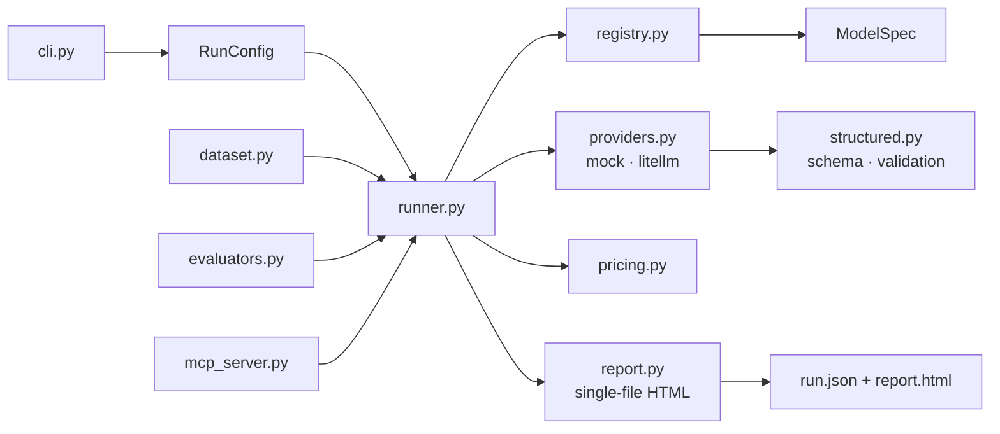

# fasteval

**One prompt. Every model. One honest report.**

fasteval is a small, provider-agnostic evaluation runner for LLM applications.
Run one prompt — or a whole dataset — across a configurable matrix of models,
reasoning efforts and providers, save every response, and get a readable
standalone HTML comparison report with cost, latency and token metrics.

[](https://github.com/semenovdv/fasteval/actions/workflows/ci.yml)
[](https://github.com/semenovdv/fasteval)
[](#development)
[](https://github.com/astral-sh/ruff)
[](https://mypy-lang.org/)
[](LICENSE)

<p align="center">
  
</p>

## Why fasteval

- **Zero-setup demo** — `--providers mock` runs the full pipeline with no API key.
- **Honest metrics** — disjoint token buckets (input / output / reasoning / cached), per-bucket pricing from your registry, no fake TTFT without streaming.
- **Structured output that verifies** — compact schema syntax compiles to JSON Schema, is sent to the provider, and every response is validated against it.
- **Real evaluation loop** — JSONL/CSV datasets, deterministic evaluators (`exact_match`, `contains`, `json_valid`, `regex`), repeated runs for stability.
- **Agent-ready** — non-interactive CLI returning structured JSON, plus an MCP server so assistants can run evaluations themselves.
- **Boring engineering** — strict typing, 92% branch coverage, ruff + mypy + coverage gates in CI, single-file reports with zero telemetry.

## Quick start

```bash
# 1. Install
python3 -m pip install -e '.[native]'   # or just '.[dev]' for hacking

# 2. Try it right now - no API key needed
fasteval --prompt "Explain evaluation in one sentence" --providers mock --out runs/demo

# 3. Run against a real model
cp .env.example .env                    # add your OPENAI_API_KEY
fasteval --prompt "Explain evaluation in three bullets" \
         --providers openai --out runs
```

Every run writes a timestamped directory under `--out` containing `run.json`
(machine-readable) and `report.html` (a standalone dashboard you can open or
send to anyone).

Exit codes: `0` when every model completed, `1` otherwise — easy to script.

## Compare models and reasoning efforts

Models live in a TOML registry (`config/models.toml`). Each entry becomes one
or more cells in the matrix:

```toml
["openai:gpt-5.6-luna"]
provider = "openai"
model = "gpt-5.6-luna"
api_key_env = "OPENAI_API_KEY"
reasoning_efforts = "none|low"          # expands into two runs
input_cost_usd_per_mtok = 1.0           # USD per 1M tokens
cached_input_cost_usd_per_mtok = 0.1
output_cost_usd_per_mtok = 6.0
```

```bash
fasteval --prompt "Extract the key risks" --providers "openai|gemini" --out runs
```

Providers are validated against the registry; unknown names fail fast with a
helpful message. API keys are read from environment variables only — never
from the registry, never logged, and scrubbed from error messages.

## Structured output

Describe the expected JSON object in a compact syntax:

```bash
fasteval \
  --prompt "Extract all relevant invoice fields" \
  --structured-output 'invoice_number:str("Unique identifier"),total:float("Amount incl. tax"),line_items:str[]("Items"),notes:str?' \
  --providers openai \
  --out runs/invoice
```

| Syntax | Meaning |
|---|---|
| `name:str,int,float,bool` | scalar types (aliases: `string`, `integer`, `number`, `boolean`) |
| `tags:str[]` | array of items |
| `notes:str?` | optional field (dropped from `required`) |
| `desc:str("Why")` | description passed to the model |

The schema is sent to the provider as strict JSON Schema, and every response
is validated locally before it reaches `run.json`. Mock runs generate
schema-valid answers, so structured pipelines can be tested offline.

## Files and images

Attach documents to any run — images become vision parts, PDFs are sent as
file parts, plain text files are inlined:

```bash
fasteval --image screenshot.png \
  --prompt "Return the bounding box of the main widget" \
  --structured-output 'x:int("X coord"),y:int,width:int,height:int' \
  --providers openai --out runs/image

fasteval --file invoice.pdf --prompt "Extract the totals" --providers openai --out runs/pdf
```

## Datasets, evaluators, consistency

Point `--dataset` at a JSONL/CSV file to evaluate many prompts at once:

```jsonl
{"id": "capital-france", "prompt": "Capital of France? City name only.", "expected": "Paris", "evaluator": "exact_match"}
{"id": "json-output",    "prompt": "Return {\"status\": \"ok\"} as JSON.", "evaluator": "json_valid"}
{"id": "has-year",       "prompt": "Mention the current year.", "evaluator": "regex", "pattern": "20[0-9]{2}"}
```

```bash
fasteval --dataset cases.jsonl --nruns 3 --providers openai --out runs/dataset
```

`--nruns 3` repeats every case three times so you can see stability, not luck.
Reports aggregate pass rates, latency and cost per model across all attempts.

## The report

Each `report.html` is a self-contained dashboard (Chart.js from CDN, no build
step, no telemetry):

- summary cards: success rate, total cost, average latency, fastest / cheapest / top-throughput runs
- sortable and filterable comparison table with export to CSV and Markdown
- charts for latency, throughput, token usage and cost breakdown
- detailed result cards with full outputs, errors and evaluator verdicts
- per-model aggregates when running datasets

## MCP server

fasteval speaks [Model Context Protocol](https://modelcontextprotocol.io), so
Claude Desktop, Claude Code or any MCP client can run evaluations as a tool:

```bash
claude mcp add fasteval -- fasteval-mcp
```

Exposed tools: `run_evaluation` (full matrix runner), `list_models` (registry
inspector), `get_run` (saved-run summarizer). See
[`examples/04_mcp_server.md`](examples/04_mcp_server.md).

## Python API

```python
import asyncio
from fasteval import RunConfig, run, save_report

config = RunConfig(prompt="Summarize eval best practices", providers=frozenset({"mock"}))
results = asyncio.run(run(config))
save_report(config, results, "runs")
print(results[0].output, results[0].latency_ms)
```

## Architecture



Adding a provider means implementing the single `call_model` contract in
`providers.py`; adding a model means adding five lines to the TOML registry.
No other layers need to change.

## Development

```bash
make dev        # install with dev tooling
make check      # ruff + mypy --strict + tests with 85% coverage floor
make demo       # no-API-key mock demo
make format     # auto-fix style
```

The test suite runs fully offline on mocks; live provider calls are opt-in
and never run in CI.

## Limitations (by design)

- No streaming yet — TTFT is reported as unavailable rather than faked; latency and throughput are end-to-end.
- One prompt template per case; no few-shot templating or conversation history.
- Evaluators are deterministic heuristics; LLM-as-judge scoring is not included.
- Pricing comes from your registry, not a live price feed — keep it current.

See [`docs/ROADMAP.md`](docs/ROADMAP.md) for where this is heading.

## License

MIT — see [LICENSE](LICENSE).
